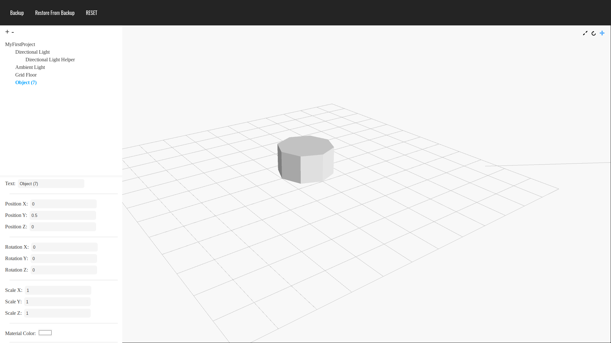

# Environment Composer:
Almost a year ago (on the 6th of April), I began a project - similar to this, called "Mesh Composer". I have since come to terms with the fact that... well... the code isn't that good. Anyway, I decided to redo Mesh Composer - which is this project - which was started somewhere around the 4th of March (I think).

# Contributing
I would be grateful if you were able to contribute in any way! Feel free to either find something to help with in the `TODO` section - or if you would prefer to do something else, just open a new issue, and assign yourself to it.

# TODO: 
- [ ] Make input fields autoupdate
- [ ] Add a way to see the keyboard shortcuts when you launch the page - with a popup.
- [ ] Add a popup with usage instructions when you first launch it.
- [ ] Make this TODO list with github issues & project boards instead.
- [ ] Improve Code:
&nbsp;- [ ] Don't call functions from ONE file, if the functions are created in another file which is loaded after the "ONE" file in the html.
&nbsp;- [ ] Add classes for everything.
- [ ] Allow custom shapes to be added.
- [ ] Add a better viewcontroller which can pan up & down, and ideally orbits around the mouse cursor.
- [ ] Add icons for each of the shapes that can be added.
- [ ] Add a popup for shortcuts for everything (like blender spacebar).
- [ ] Add material.shading to the properties panel.
- [ ] Add handles to move objects in the scene view.
- [x] Add more stuff to the README.
- [x] Allow objects to be selected by clicking them in the canvas.
- [x] Add a function to update everything in the scene at once.
- [x] Allow keyboard shortcuts & a button to change the mode (translate, rotate, scale).
- [x] Allow keyboard shortcuts to change those values (translation, rotation, scale), and display the keyboard shortcuts in the relevant labels.
- [x] Allow shapes to be dynamically added.
- [x] Add rotation inputs.
- [x] Add scale inputs.
