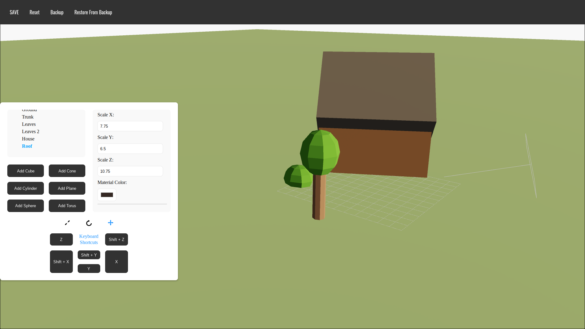

# Environment Composer:
Almost a year ago (on the 6th of April), I began a project - similar to this, called "Mesh Composer". I have since come to terms with the fact that... well... the code isn't that good. Anyway, I decided to redo Mesh Composer - which is this project - which was started somewhere around the 4th of March (I think).

# Contributing
I would be grateful if you were able to contribute in any way! Feel free to either find something to help with in the projects board - or if you would prefer to do something else, just open a new issue, and assign yourself to it.
Please also feel free to post any questions or comments in the "discussions" section!
Any contribution is fine - code, documentation, etc. 
