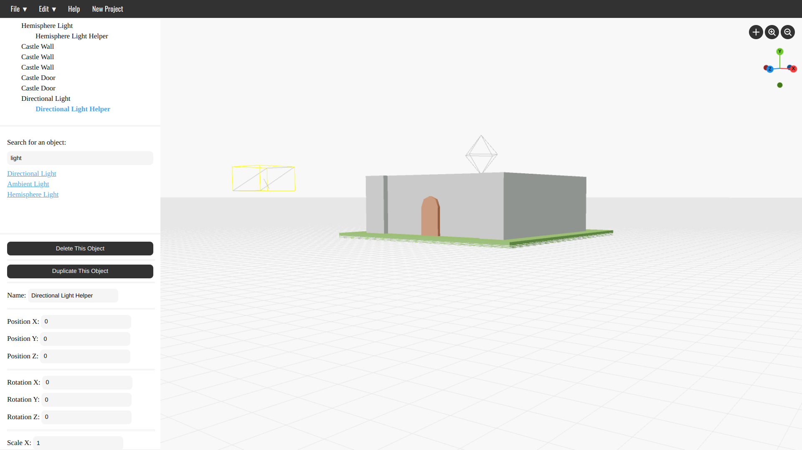

# Environment Composer:
Almost a year ago (on the 6th of April), I began a project - similar to this, called "Mesh Composer". I have since come to terms with the fact that... well... the code isn't that good. Anyway, I decided to redo Mesh Composer - which is this project - which was started somewhere around the 4th of March (I think).

This branch was created to re-do the project to implement some core features such as the following:
* A separate camera to move and reposition - which is the point of view of the final render.
* A dark & light theme with a way to switch between them.
* The ability to add & customise windows, their sizes, what type of window they are, etc.
* A way to add a shortcut to everything in Matrixr, which can be accessed by right-clicking.
* The ability to do proper 3D modelling & to select individual parts of a mesh as well as the whole thing.
* The ability to add modifiers to objects.
* A raytracing renderer.
* Particle systems.
* A prompt to change the resolution of geometric shapes.
* An easier way to change an object's transforms without having to use the properties menu.

# Usage
Matrixr was designed to be very easy to use. You can either download the project & run the index.html file, or you can just view the project via Github pages - https://chillitech.github.io/Matrixr/.

# Contributing
I would be grateful if you were able to contribute in any way! Feel free to either find something to help with in the projects board - or if you would prefer to do something else, just open a new issue, and assign yourself to it.
Please also feel free to post any questions or comments in the "discussions" section!
Any contribution is fine - code, documentation, etc. 
